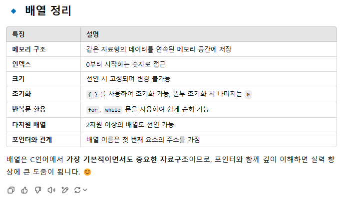

# iot-C-2025
IoT 개발자 C언어 리포지토리

## 1일차
- Visual Studio 실행
	1. Visual Studio 실행
	2. 새프로젝트 만들기 -> 빈 프로젝트 -> 경로 설정 -> 파일생성
	3. 솔루션 탐색기 -> 소스파일에서 -> HelloWorld.c 파일생성
- HelloWorld
	```C
	// 기본 형태
	#include <stdio.h> // stdio == 파일이름, .h == 헤더파일
	int main()
	{
		printf("Hello World!!");
		return 0;
	}
	```
- C언어 기초(절차적 언어)
	- main함수는 어딜가던 항상 있어야함

- 자료형 출력 - int(정수), double(실수)
	- 정수형 - %d
	- 실수형 - %lf
		- %.4는 소숫점아래 4째자리까지만 출력
	```C
	/*출력*/
	#include <stdio.h>

	int main()
	{
		printf("정수출력: %d\n", 10);		   // 정수출력 %d
		printf("실수출력: %lf\n", 3.14);	   // 실수출력 %lf
		printf("실수출력: %.4lf\n", 3.141592); // %.4는 소숫점아래 4째자리까지만 출력
		printf("%d 그리고 %d\n", 10, 20);	   // 순서대로 %d에 대입
		return 0;
	}

	/* 실수 자료형 */
	#include <stdio.h>

	int main()
	{

		float f = 1.12345678912345;
		double d = 1.12345678912345;

		printf("float: %.15f\n", f);
		printf("double: %.15lf\n", d);

		return 0;
	}
	```
	
- 문자열 출력
	- 문자 - %c - ''로 감싼 문자를 출력
	- 문자열 - %s - ""로 감싼 문자열을 출력
	```C
	/* 문자 */
	#include <stdio.h>
	int main(void)
	{
		printf("%c\n", 'a');		// 문자는 ''로 감싼다
		printf("김찬수\n");			
		printf("%s\n", "김찬수");	// 문자열은 ""로 감싼다

		return 0;
	}
	```

- 변수 선언
	- 대입 연산자를 사용해 변수 선언
		- 변수: 변할수 있는 수
	```C
	/* 변수 선언 */
	#include <stdio.h>

	int main()
	{
		int c;				// 자료형 변수명
		c = 10;
		int num2 = 10;		// 변수의 초기화 (변수를 만들면서 값을 넣음)
		char ch = 'A';		// 문자타입의 변수 선언

		printf("c의 값: %d\n", c);
		printf("num2의 값: %d\n", num2);
		printf("ch의 값: %c\n", ch);

		return 0;
	}
	```

- 배열
	- 동일한 자료형을 연속적으로 저장할 수 있는 공간
	```C
	/* 배열 */
	#include <stdio.h>

	int main()
	{
		char str[10] = "banana";			// 문자타입 배열선언

		printf("str: %s\n", str);
		printf("str[0]: %c\n", str[0]);		// banana의 0번 인덱스 b가 출력
		printf("str[1]: %c\n", str[1]);
		printf("str[5]: %c\n", str[5]);
		printf("str[6]: %c\n", str[6]);
		printf("str[6]: %s\n", str[6]);		// C언어에서 문자열끝에는 항상 null문자가 온다

		char str2[6] = "apple";
		printf("str: %s\n", str2);
		str2[0] = 'A';
		printf("str2: %s\n", str2);
		//str = str2; 배열은 대입연산 불가능

		return 0;
	}
	/* 정수형 배열 */
	#include <stdio.h>

	int main()
	{
		int ary[5] = { 1, 2, 3, 4, 5 };			// 정수형 배열선언 및 값을 지정 // 정수형 배열은 null자리가 필요 없음

		printf("ary[0]: %d\n", ary[0]);			// 인덱스 0번자리의 1출력
		ary[3] = 400;
		printf("ary[3]: %d\n", ary[3]);

		for(int i = 0; i < 5; i++){
			printf("ary[%d]: %d\n", i, ary[i]);
		}
		return 0;
	}
	```

- scanf()
	- 입력받은 값을 출력
	```C
	/* 입력 - scanf() */
	#define _CRT_SECURE_NO_WARNINGS
	#include <stdio.h>

	int main()
	{
		int inputVal;
		printf("정수를 입력하세요: ");
		scanf_s("%d", &inputVal);							// &주소연산자, scanf()에는 다른 어떤 문자열도 들어갈 수 없다

		printf("입력한 정수는 %d 입니다.\n", inputVal);

		int n1, n2;
		printf("두개의 정수를 입력하세요");
		scanf_s("%d %d", &n1, &n2);

		printf("입력한 정수는 %d 와 %d 입니다.\n", n1, n2);
		return 0;
	}
	```

	- scanf를 활용한 나이와 이름 출력
	```C
	#include <stdio.h>

	int main()
	{
		int age = 0;
		char str[20];

		printf("나이를 입력하세요: ");
		scanf_s("%d", &age);
	
		printf("이름을 입력하세요: ");
		scanf_s("%19s", str, (unsigned int)sizeof(str));

		printf("입력한 나이: %d\n입력한 이름: %s", age, str);
		return 0;
	}
	```

## 2일차
- 논리·비트 연산자
	1. && -> AND (둘 다 참이어야 참)
	2. || -> OR (둘 중 하나라도 참이면 참)
	3. ! -> NOT (참을 거짓으로, 거짓을 참으로)
	4. ~ -> 비트 반전 (모든 비트를 0 <-> 1로 뒤집음, 결과적으로 -1을 뺀 음수 형태가 됨)

	```C
	#define _CRT_SECURE_NO_WARNINGS
	#include <stdio.h>

	int main()
	{
		int n = 30;
		int res;
		res = (n > 10) && (n < 20);	
		printf("res: %d\n", res);
		res = (n < 10) || (n > 20);	
		printf("res: %d\n", res);
		res = !(n >= 30);			
		printf("res: %d\n", res);
		res = ~n;					
		printf("res: %d\n", res);
		res = n << 1;				
		printf("res: %x\n", res);
		res = res >> 1;				
		printf("res: %x\n", res);

		int n2 = 143;				
		res = n2 << 1;				
		printf("res: %x\n", res);
		res = res >> 1;				
		printf("res: %x\n", res);
		return 0;
	}
	```

- 시프트 연산자
	1. << -> 왼쪽 시프트 연산자(Left Shift)로, 비트를 왼쪽으로 이동시키는 연산
	2. << -> 오른쪽 시프트 연산자(Right Shift)로, 비트를 오른쪽으로 이동시키는 연산

	```C
	#include <stdio.h>
	int main()
	{
		char ch = 0x7f;					// 0b 0111 1111
		unsigned char uch = 0x7f;
		printf("ch: %x, uch: %x, ch: %u, uch: %u\n", ch, uch, ch, uch);

		char ch1 = 0x9f;				// 0b 1001 1111
		unsigned char uch1 = 0x9f;
		printf("ch1: %x, uch1: %x\n", ch1, uch1);

		ch1 >>= 1;						// 0b 1001 1111
		uch1 >>= 1;						// 0b 0100 1111
		printf("ch1: %x, uch1: %x\n", ch1, uch1);
		ch1 != uch1;

		return 0;
	}
	```
	
- 삼항 연산자
	- (조건 ? 값1 : 값2)는 조건이 참이면 값1을 반환, 거짓이면 값2를 반환하는 연산자
	- 삼항 연산자의 장점
	    1. 코드가 간결해짐 → if-else 문보다 짧고 직관적.
	    2. 단순한 조건 판단에 유용함 → 값을 바로 대입 가능.
	    3. 복잡한 조건이 많다면 if-else를 사용하는 것이 가독성이 좋을 수도 있음.

	```C
	#include <stdio.h>
	int main()
	{
		int n = 10, n2 = 20;
		int res;

		res = (n < n2) ? n : n2;
		printf("res: %d\n", res);

		res = n++;
		printf("n++: %d, n: %d\n",res, n);
		res = ++n2;
		printf("++n2: %d, n2: %d\n", res, n2);

		return 0;
	}
	```

- 제어문
	1. 선택제어문(if, switch)
		- if문을 활용한 간단한 숫자찾기
		```C
		#include <stdio.h>

		int main()
		{
			int n;
			while (1) {
				printf("수를 입력해주세요: ");
				scanf_s("%d", &n);
				if (n == 5) {
					printf("정답!\n");
					break;
				}
				else if (n < 5) {
					printf("땡! 큰 숫자를 입력하세요!\n");
				}
				else {
					printf("땡! 더 작은 숫자를 입력하세요!\n");
				}
			}
			return 0;
		}
		```
		- Switch문을 활용한 숫자 찾기
		- 무언가 정확한 정답을 찍거나 경우의 수가 작을때 switch문을 사용
		- case를 사용할때는 break를 까먹지 말고 쓰자!!
		```C
		/* Switch문 */
		#include <stdio.h>

		int main()
		{
			int num = 200;
			int n = 0;
			switch (num){
			case 100:
				printf("빙고");
				break;							// 반복문을 벗어난다.

			case 50:
				printf("작음");
				break;

			case 200:
				printf("큼");
				break;

			default:							// 생략 가능
				printf("이것도 저것도 아님");
				break;
			}
			return 0;
		}

		// switch(조건식) ~ case:
		```
	
	2. 반복제어문(for, while)
		- for문을 활용한 1~10까지의 합
		- for문은 반복되는 구간이 정해진 상황에서 쓰기 편하다
		- for(초기식; 조건식; 증감식;){ }
		```C
		/*for문*/
		#include <stdio.h>

		int main()
		{
			//for(초기식; 조건식; 증감식;){ }
			for (int i = 0; i < 10; i++) {
				printf("i: %d\n", i);
			}
			int sum = 0;
			for (int i = 1; i <= 10; i++) {
				sum += i;
			}
			printf("1~10까지 합은 %d입니다.", sum);
			return 0;
		}
		```
		- While문을 활용한 1~100까지의 합
		```C
		/*While문*/
		#include <stdio.h>

		int main()
		{
			int i = 1;
			while (i < 6) {
				printf("안녕하세요.%d\n", i++);
			}
			int i = 0;
			while (i < 5) {
				printf("안녕하세요.%d\n", i + 1);
				i++;
			}
			int i = 1;
			int sum = 0;
			while (i <= 100) {
				sum += i;
				i++;
			}
			printf("1 ~ 100까지의 합: %d", sum);
			return 0;
		}
		```

## 3일차
- 배열
	- 같은 자료형의 값들을 하나의 연속된 메모리 공간에 저장하는 자료구조
	- 기초 배열
	```C
	#include <stdio.h>

	int main()
	{
		int ary[5] = { 1, 2, 3, 4, 5 };		// 가장 기본적인 형태
		int ary2[] = { 6, 7, 8, 9, 10 };	// 이미 배열의 크기가 정해짐
		int ary3[5];						
		// int ary4[];								

		for (int i = 0; i < 5; i++) {
			printf("ary[%d]: %d\n", i, ary[i]);
			printf("ary2[%d]: %d\n", i, ary2[i]);
		}

		ary[2] = 100;						// ary[2]를 100으로 바꿈
		printf("ary[2]: %d\n", ary[2]);

		return 0;
	}
	```

	


- 포인터(pointer) - 주소 - 주소의 크기는 컴퓨터 환경따라 다르다.
	- 포인터 변수 - 주소를 저장할 수 있는 변수(크기는 무조건 4byte)
				  - 포인터 변수의 크기는 타입에 상관없이 일정하다. 왜냐하면, 주소의 크기는 일정하기 때문이다.
	- 기초 포인터
	```C
	#include <stdio.h>

	int main()
	{
		int p;				// int타입의 p라는 변수를 선언
		int* p;				// int타입의 "포인터 변수" p를 선언 - 포인터 변수크기는 무조건 4byte
		char* pc;			// char타입의 "포인터 변수" pc를 선언 - 포인터 변수크기는 무조건 4byte
							// point변수에 붙은 *은 아무런 의미가 없고 그냥 선언
		double *pd;			// 이름에 붙이나 자료형에 붙이나 상관은 없음
		int num = 100;
		printf("num의 주소: %p\t", &num);
		printf("num의 값: %d\n", num);
		int* p = &num;												// point변수에 붙은 *은 아무런 의미가 없고 그냥 선언
		printf("포인터변수 p에 저장된 값(주소): %p\t", p);
		printf("포인터변수 p가 가리키는 곳의 값: %d\n", *p);		// * 간접 참조 연산자
	
		num += 1;
		printf("num의 값: %d, p가 가리키는 값: %d\n", num, *p);		// 변수의 값을 변경함 - 101
		*p += 1;
		printf("num의 값: %d, p가 가리키는 값: %d\n", num, *p);		// 포인터로도 접근 가능 - 102
			return 0;
	}
	```

	- 두 값을 바꾸는 알고리즘
	```C
	#include <stdio.h>

	int main()
	{	
		// 변경 전
		int a = 10;
		int b = 20;
		printf("변경 전 a: %d, b: %d\n", a, b);

		// 변경 후 - 임시변수 선언
		int temp = a;
		a = b;
		b = temp;
		printf("변경 후 a: %d, b: %d\n", a, b);

		return 0;
	}
	```
- 
- 문자(char)고급
	- 문자 전용 함수 getchar, putchar - 송신(put), 수신(get)
	```C
	#include <stdio.h>

	int main()
	{
		int ch;

		ch = getchar();				// 한 문자를 읽어오는 함수 - 수신
		putchar(ch);				// 한 문자만 출력하는 함수 - 송신
		putchar('\n');

		printf("input: %d\n", ch);

		return 0;
	}
	```
	- 예제: 입력받는 대문자를 소문자로. 또는, 소문자를 대문자로 변환하는 프로그램
	```C
	#define _CRT_SECURE_NO_WARNINGS

	#include <stdio.h>

	int main() {
		char ch;

		while(1){
			printf("문자를 입력하세요 \n(종료버튼: [): ");
			scanf("%c", &ch);

			getchar();

			if (ch == '[') {
				break;
			}

			if (ch >= 'A' && ch <= 'Z')
			{
				ch = ch + 'a' - 'A';
			}
			else if (ch >= 'a' && ch <= 'z') 
			{
				ch = ch - 'a' + 'A';
			}
			printf("변환된 문자: %c\n\n", ch);
		}
    
		return 0;
	}
	```